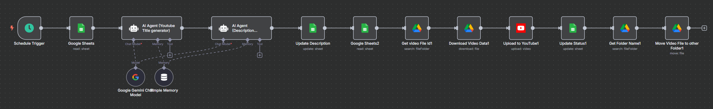

# YouTube Video Scheduling Workflow with n8n & AI  

Automate your YouTube uploads with **n8n**, **Google Sheets**, **Google Drive**, and **AI-powered title/description generation**.  
This workflow is perfect for content creators who want to save time and focus on making videos while the system handles uploads automatically.  

---

## 📌 Features  
- **Automatic scheduling** – Upload videos at a specific time using n8n’s Schedule Trigger.  
- **AI-powered titles** – Generate SEO-friendly, click-worthy titles using Google Gemini AI.  
- **AI-powered descriptions** – Create keyword-rich descriptions with hashtags for maximum reach.  
- **Google Sheets integration** – Store video details, track upload status, and keep everything organized.  
- **Google Drive integration** – Fetch videos from your Drive and move them after upload to keep your storage tidy.  
- **One-click uploads to YouTube** – No manual uploading or copy-pasting.  

---

## 📂 Workflow Overview  

1. **Schedule Trigger** – Starts the automation at your chosen time.  
2. **Read from Google Sheets** – Fetches video names and metadata.  
3. **AI Title Generator** – Creates an engaging, SEO-optimized title from the video name.  
4. **AI Description Generator** – Writes a keyword-rich description with your channel name and hashtags.  
5. **Update Google Sheets** – Saves the generated title and description.  
6. **Get Video from Google Drive** – Finds and downloads the video file.  
7. **Upload to YouTube** – Publishes the video with the AI-generated title and description.  
8. **Update Status in Sheets** – Marks the video as uploaded.  
9. **Move File in Google Drive** – Moves uploaded video to another folder for organization.  

---

## 🖼 Workflow Diagram  

  

---

## 🛠️ Requirements  
- [n8n](https://n8n.io) installed locally or on a server.  
- Google Sheets API credentials.  
- Google Drive API credentials.  
- YouTube Data API credentials.  
- Google Gemini API key (for AI title & description generation).  

---

## 🚀 Setup Instructions  

1. **Import the workflow** into your n8n instance.  
2. **Connect your credentials** for Google Sheets, Google Drive, YouTube, and Gemini AI.  
3. **Prepare your Google Sheet** with columns for video name, title, description, status, etc.  
4. **Upload videos to Google Drive** in your source folder.  
5. **Set the schedule** in the Schedule Trigger node.  
6. Run the workflow and watch your videos get uploaded automatically!  

---

## 📺 YouTube Tutorial  
I’ve made a full **step-by-step tutorial** on how to set this up in n8n. Watch it here:  
👉 [YouTube Video Link]  

---

## 🏷️ Tags / Keywords  
`n8n` `youtube-automation` `google-drive` `google-sheets` `ai` `gemini` `automation` `content-creator` `workflow` `seo` `youtube-uploader` `youtube-scheduler`  

---

## 📬 Connect with Me  
Created by **Waqar Mahmood**  
- 📧 waqar.mahmood0987@gmail.com  
- 📞 +92 346 6211392  
- 🌐 [My YouTube Channel](https://www.youtube.com/channel/UCAXWEy6yIPq-SxZW6-zsN0w)  

---

⭐ **If you use this workflow, don’t forget to star the repo and share it with other creators!**
